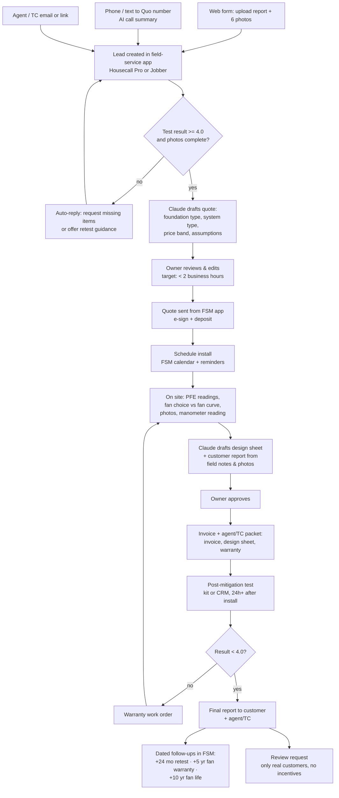

# WS6: AI Operations Stack

**Summary**
1. **Five paid tools at about $150–170/month:** a field-service app (Housecall Pro Basic *or* Jobber) for intake, quotes, scheduling, invoicing, and reminders; Quo (formerly OpenPhone) for the business line with call transcripts; Google Workspace for email and document storage; Claude Pro for drafting quotes, design sheets, and reports; and QuickBooks only if the field-service app's accounting sync needs it.
2. **AI does the paperwork, not the decisions.** It reads the test report and photos, drafts the quote and design sheet, and drafts the customer report. The owner approves every quote and every design.
3. **The 2-hour quote** comes from a fixed intake form (report upload plus 6 photos), which feeds an AI-drafted quote, owner review, and a send from the field-service app.
4. **Recurring revenue is automated** with dated follow-ups at install +30 days (post-test check), +24 months (retest), +5 years (fan warranty end), and +10 years (fan end of life).
5. **Simple over clever:** no custom code in year 1. One spreadsheet export per month is the backup.

> Prices come from **web-search excerpts** of vendor and review pages (direct loads were blocked). Vendors change plans often, so confirm on each pricing page before subscribing. No accounts were created.

---

## 1. Workflow

## 2. Tool recommendations

| Function | Tool | Current price | Label | Why chosen | Source |
|---|---|---|---|---|---|
| Field service (CRM, quotes, scheduling, invoicing, payments, follow-ups) | **Housecall Pro Basic** (1 user) | $59/mo annual or $79/mo monthly | S | Cheapest single-user plan among mainstream field-service apps; covers quoting, scheduling, and payments. Basic reportedly lacks the QuickBooks sync | [Housecall Pro pricing](https://www.housecallpro.com/pricing/); [SchedulingKit breakdown](https://schedulingkit.com/pricing-guides/housecall-pro-pricing) |
| *(Alternative)* Field service | **Jobber** Core / Connect | Core $29–39/mo ⚠ (sources differ); Connect $139/mo monthly (includes online booking, automated reminders, QuickBooks sync) | S | Pick this if automated reminders and QBO sync matter more than cost. Trial both and check that dated follow-ups at +24 mo and +5 yr are supported on the chosen tier | [Jobber pricing](https://www.getjobber.com/pricing/); [Capterra](https://www.capterra.com/p/127994/Jobber/pricing/) |
| Business phone and text | **Quo** (formerly OpenPhone) Starter; Business tier adds AI call summaries and transcripts | Starter $15/mo annual ($19 monthly); Business $23 ($33) | S | Separates business from personal lines; shared inbox; transcripts feed the AI quote step | [Quo pricing blog](https://www.quo.com/blog/quo-pricing/) |
| Email, calendar, document storage | **Google Workspace Business Starter** | $7/user/mo annual ($8.40 monthly) | S | Branded email; Drive folder per job for photos and PDFs | [Google Workspace pricing](https://workspace.google.com/pricing) |
| AI drafting (quotes, design sheets, reports, templates) | **Claude Pro** | $20/mo (monthly); annual discount available | S | Reads test-report PDFs and photos; drafts quotes and reports from a saved project with the price book, standards notes, and templates. No integration build needed | [claude.com/pricing](https://claude.com/pricing) |
| Accounting | **QuickBooks Online Simple Start** (only if needed) | $38/mo (after an Aug 2026 increase) | S | CPA-friendly. Skip in year 1 if the field-service app's reporting plus a CPA at tax time is enough | [Certum Solutions](https://www.certumsolutions.com/library/quickbooks-price-increase-august-2026) |
| Website and intake form | Housecall Pro / Jobber booking page, or a simple site builder | $0–25/mo | E | Use the field-service app's request form first, then add a site. Upload fields for the report and photos are required | |
| Google Business Profile | Google | Free | S | Main local discovery channel | [google.com/business](https://www.google.com/business/) |

**Monthly total, recommended stack:** Housecall Pro Basic $79 + Quo Business $33 + Workspace $8.40 + Claude Pro $20 = **$140/mo** on monthly billing (about $110 annual). Add QuickBooks at $38 if needed, for **≈ $150–180**. WS4 uses $170.

## 3. AI prompts and assets to prepare (one-time)
1. **Price book.** A table of system types, base price, and adders (extra suction point, exterior vs attic route, liner sq ft, electrical). This is what keeps AI quotes consistent.
2. **Quote template.** Scope, assumptions, exclusions, price, timeline, guarantee, warranty.
3. **Design-sheet template.** Suction-point sketch, PFE readings table (location, distance, Pa), fan selection (model, curve operating point, static pressure, airflow), pipe route, electrical approach, labels installed.
4. **Customer report template.** Before/after readings, photos, maintenance notes, retest date.
5. **Standing instruction for the AI project:** it drafts only; it never invents readings, never fills in values it didn't receive, and flags missing photos.

## 4. Metrics to track from day 1
Time-to-quote (median hours) · quote-to-close % · average ticket · CM per job · post-test pass rate on the first try · jobs by channel (inspector, agent, TC, direct) · retests booked per reminder sent.
